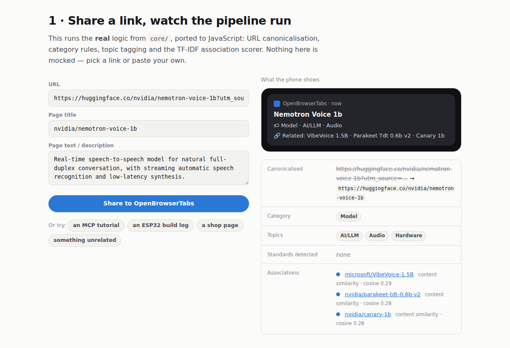
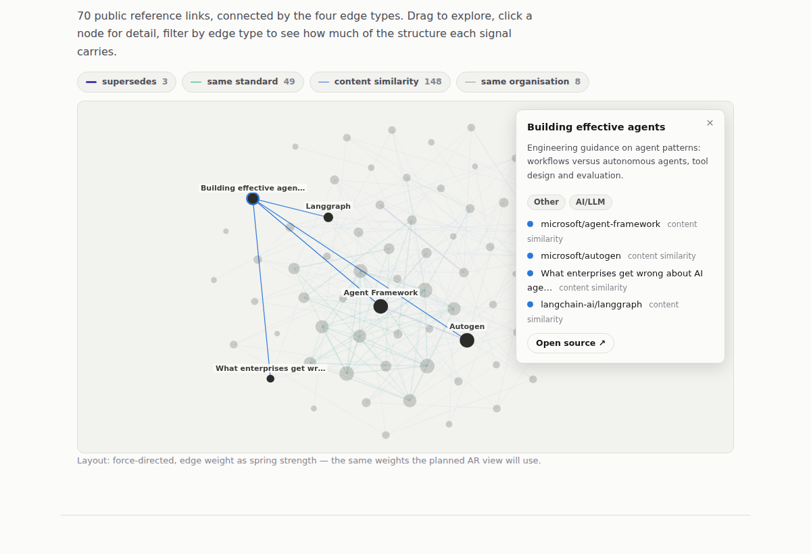

<h1 align="center">OpenBrowserTabs</h1>

<p align="center"><em>A second brain for the tabs you never close.</em></p>

<p align="center">
  <a href="https://krausstt.github.io/openbrowsertabs/"><strong>▶ Live demo</strong></a> ·
  <a href="https://github.com/krausstt/openbrowsertabs/releases"><strong>⬇ Download APK</strong></a> ·
  <a href="docs/design/2026-07-19-second-brain-architektur.md"><strong>📐 Architecture</strong></a>
</p>

<p align="center">
  
  
  
  
</p>

---

Share a link from any Android app. It gets fetched, cleaned, categorised and
**connected to what you already saved** — before you have finished putting the
phone down. No account, no server required, no unread counter.

The project started from a real problem: a browser profile with **2,562 open
tabs** that had become impossible to navigate. Deduplicating and canonicalising
them produced **1,385 unique links — a 46 % duplicate rate** — and made it
obvious that the missing piece was not storage but *re-encounter*: being
reminded of what you already have, at the moment you look at something new.

<p align="center">
  
  
</p>

## Three ways in

| | |
|---|---|
| **[Live demo](https://krausstt.github.io/openbrowsertabs/)** | Runs the real enrichment logic in the browser on a public reference corpus. Paste any URL and watch it get canonicalised, tagged and matched. |
| **[APK](https://github.com/krausstt/openbrowsertabs/releases)** | Signed debug builds, published from CI on every push. Installable as an update over previous builds; works with [Obtainium](https://github.com/ImranR98/Obtainium). |
| **Source** | `core/` is pure Kotlin/JVM and unit-tested without an emulator; `pipeline/` is the Python reference implementation the Kotlin port is validated against. |

## How it works

```
 Android share sheet          core/ (pure Kotlin, JVM-testable)         SQLite
 ┌──────────────┐            ┌────────────────────────────────┐        ┌──────────┐
 │ any app  →   │──text──►   │ LinkParser  · extract + dedupe │───────►│ links    │
 │ "Tab sichern"│            │ UrlNormalizer · AMP, trackers  │        │ entities │
 └──────────────┘            │ RedirectResolver · share.google│        │ edges    │
                             │ ArticleExtractor · jsoup       │        └────┬─────┘
 WorkManager                 │ Categorizer · category + tags  │             │
 ┌──────────────┐            │ TextSimilarity · TF-IDF cosine │             │
 │ paced fetch  │──html──►   │ Headline · short display name  │        ┌────▼─────┐
 │ 2–5 s/domain │            └────────────────────────────────┘        │ notify   │
 └──────────────┘                                                      │ + digest │
                                                                       └──────────┘
```

1. **Capture** — a share-sheet target saves the link in well under a second,
   offline-capable. Shortener links (`share.google`, `goo.gl`, …) are resolved
   first; a failure keeps the short URL queued rather than losing it.
2. **Enrich** — a WorkManager job fetches the page with human pacing
   (2–5 s between requests, domains interleaved), extracts title, description
   and article text, then derives category and topic tags **from the extracted
   text**, not from the URL slug.
3. **Associate** — TF-IDF cosine over title, tags and body finds the closest
   existing links. The result arrives as a notification: a one-line summary,
   the tags, and *what it connects to in your collection*.
4. **Navigate** — the collection is a typed graph, browsable in-app today and
   in the [web demo](https://krausstt.github.io/openbrowsertabs/); an AR view is
   designed but not built.

## Design decisions worth defending

**TF-IDF before embeddings.** The association layer shipped as plain Kotlin
TF-IDF cosine: no model download, no licence question, unit-testable on the
JVM. It is good enough to surface *Parakeet* and *Canary* when you save
*Nemotron Voice*, and it turned the ONNX embedding upgrade into a swap behind
one interface instead of a prerequisite for shipping anything.

**Typed edges over a single similarity score.** Verified against real captured
data: `microsoft/agent-framework` was linked to `microsoft/VibeVoice` — both
Microsoft, no actual relation — while the genuinely useful link to an MCP
tutorial scored the same way. One number cannot express both, so the graph
distinguishes `same_organization` (weak) from `discusses_same_standard`
(strong), plus `supersedes` for documented successor relationships.
[Try the toggle in the demo.](https://krausstt.github.io/openbrowsertabs/#demo)

**Apache-2.0 / MIT only in the product path.** EmbeddingGemma scored best on
quality per megabyte but ships under the Gemma Terms; the chosen upgrade is
`granite-embedding-278m-multilingual` (Apache-2.0) — marginally behind on
paper, unencumbered in practice.

**Empty beats fabricated.** Below the similarity threshold the app shows no
connections at all. A wrong "related to" costs more trust than a missing one.

**No guilt mechanics.** No unread badge, no streak, no inbox-zero pressure.
The pile is externalised working memory; shaming its size is how read-later
apps become graveyards.

## Tried and dropped

- **Scraping the private YouTube Watch Later list.** Login inside an app
  WebView is refused by Google, the DOM breaks on every layout change, and it
  risks the main account. Google Takeout turned out to no longer offer
  playlists at all — verified, not assumed. Sharing individual videos is the
  boring, durable path.
- **Screenshots as the primary enrichment input.** A multimodal model can read
  a page screenshot, but it sees one viewport, costs far more tokens, and loses
  to extracted text everywhere except pages that defeat extraction.
- **A NotebookLM push integration.** The API exists only for Gemini
  Enterprise. The realistic design is a structured Markdown export, or writing
  the digest to a Drive document that NotebookLM already auto-syncs.
- **Room and Hilt in the MVP.** The development environment cannot run Android
  tooling, so every codegen dependency was an unverifiable risk. Plain SQLite
  behind a small interface kept CI honest.

## Bugs the field test caught

| Symptom | Root cause | Fix |
|---|---|---|
| Every video tagged "fitness"; a LEGO build linked to men's health | The health topic rule matched the bare word `watch` — and every YouTube URL contains `/watch?v=` | Replaced with `smartwatch`; tags now derived from extracted text |
| Unrelated Hugging Face pages all "related" to each other | The site-wide boilerplate description entered the similarity corpus | Descriptions excluded from scoring; text repeated across ≥2 rows treated as boilerplate |
| Notification title read `nvidia/model · Hugging Face` | Raw `<title>` used verbatim | Repo name derived from the URL path; site suffix stripped elsewhere |
| Chrome shared `share.google/…` instead of the article | Google's share shortener hides the target behind a redirect | Redirect resolver follows known shorteners before saving |
| An app source file silently missing from CI | The privacy rule `data/` in `.gitignore` also matched the Kotlin `data` package | Anchored to `/data/`, verified with `git check-ignore` |

## Privacy

**Personal link collections never enter this repository.** Raw exports and
derived datasets live in `/data/` and are gitignored; the web demo ships a
hand-curated corpus of public reference material (model cards, repos, papers)
generated by `web/build_demo_data.py`. The Android app stores everything
locally and talks to no backend.

## Project layout

```
core/          Pure Kotlin, no Android dependencies — normalizer, categorizer,
               extractor, similarity, headline. 46 unit tests, runs on the JVM.
app/           Android app: share receiver, WorkManager enrichment, SQLite
               store, Compose UI, notifications.
pipeline/      Python reference implementation + PDF tab-export ingestion.
               The Kotlin port is validated against its output.
web/           The live demo: JS port of the core logic, generated public
               corpus, force-directed graph.
docs/design/   Problem-space research, architecture decisions, decision log.
docs/sessions/ Development notes per working session.
```

## Build

```bash
# core logic, no Android SDK required
./gradlew :core:test

# debug APK (needs the Android SDK)
./gradlew :app:assembleDebug -PbuildNumber=1

# python pipeline over PDF tab exports
pip install pypdf
python3 pipeline/tabs_pipeline.py data/ data/dataset.json

# regenerate the public web demo corpus
python3 web/build_demo_data.py > web/data.json
```

## Status

Working today: capture, shortener resolution, fetch and extraction, category
and topic tagging, TF-IDF associations, notification with related links,
in-app browsing and detail view, signed CI releases.

Designed, not built: typed `entities`/`edges` tables, ONNX embedding upgrade,
weekly goal-weighted digest with text-to-speech, HuggingFace "model radar"
for successor detection, AR graph navigation, NotebookLM export. See
[`docs/design/`](docs/design/) for the reasoning and the decision log.
